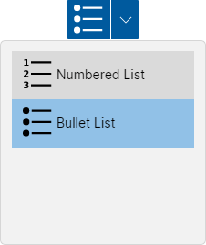

# ToggleSplitButton

The `ToggleSplitButton` functions as a [`ToggleButton`](https://docs.avaloniaui.net/docs/controls/togglebutton) with primary and secondary parts that can each be pressed separately. The primary part behaves like normal `ToggleButton` and the secondary part opens a [`Flyout`](https://docs.avaloniaui.net/docs/controls/flyouts) with additional actions.

 
The `ToggleSplitButton` has only two states: checked and unchecked. Indeterminate is not supported like it is with a standard `ToggleButton`. This was done intentionally to match WinUI and restricts the control’s usage. The ToggleSplitButton should only be used to turn features on/off. Anything other than that is currently considered poor practice from a usability standpoint.


## Is this the right control? 

A `ToggleSplitButton` is a fairly specialized control and its usage should be restricted to where it makes clear sense from a user-standpoint. It is intended to turn a feature on/off while allowing some additional configurations to be specified rather than the default.

Like a [`SplitButton`](https://docs.avaloniaui.net/docs/controls/splitbutton), the most common action should be the default and what is shown in the primary part. However, unlike the `SplitButton`, pressing the primary part will turn this feature on or off instead of simply invoking an action. Additional configurations for the feature should be added to the `Flyout` which is shown when the secondary (drop down) part is pressed. 

 
Pressing a configuration in the `Flyout` should either (1) turn on the feature with the selected configuration, or (2) change the feature to the selected configuration. Pressing a configuration in the `Flyout` should never turn off the feature – that can only be done by toggling the primary part.


## Common Properties

| Property    | Description                                                    |
|-------------|----------------------------------------------------------------|
| `Content`   | The content to display in the primary part                     |
| `Flyout`    | The `Flyout` which shows up when the secondary part is clicked |
| `Command`   | A command to be invoked when the primary button is clicked     |
| `IsChecked` | Gets or sets if the `ToggleSplitButton` is checked             |

## Pseudoclasses

| Pseudoclass    | Description                                                                                                                                                               |
|----------------|---------------------------------------------------------------------------------------------------------------------------------------------------------------------------|
| `:pressed`     | Set when the entire `ToggleSplitButton` is pressed using a keyboard input such as Space or Enter. In this state no distinction is made between primary or secondary parts |
| `:flyout-open` | Set when the `Flyout` is open                                                                                                                                             |
| `:checked`     | Set when the `ToggleSplitButton` is checked. (`IsChecked="true"`)                                                                                                         |

## API Reference

[ToggleSplitButton](http://reference.avaloniaui.net/api/Avalonia.Controls/ToggleSplitButton/)

## Source code

[ToggleSplitButton.cs](https://github.com/AvaloniaUI/Avalonia/blob/master/src/Avalonia.Controls/SplitButton/ToggleSplitButton.cs)

## Examples

### Basic example

```xml
<ToggleSplitButton Content="Content"
                   IsChecked="{Binding IsChecked}">
    <ToggleSplitButton.Flyout>
        <MenuFlyout Placement="Bottom">
            <MenuItem Header="Item 1">
                <MenuItem Header="Subitem 1" />
                <MenuItem Header="Subitem 2" />
                <MenuItem Header="Subitem 3" />
            </MenuItem>
            <MenuItem Header="Item 2"
                      InputGesture="Ctrl+A" />
            <MenuItem Header="Item 3" />
        </MenuFlyout>
    </ToggleSplitButton.Flyout>
</ToggleSplitButton>
```


*SplitButton (Flyout closed, unchecked)*


*SplitButton (Flyout closed, checked)*


*SplitButton (Flyout opened, checked)*

### Text editor with numbered or bulleted list example

Continuing the text editor example from `SplitButton`, a common use case of the `ToggleSplitButton` is to add bulleted/numbered lists to text. In this example the primary part will toggle the list on/off while the secondary part will open a `Flyout` and allow selecting the bullet or number style.

```xml
<!-- We have the following Icons defined in our Resources -->
<PathGeometry x:Key="IconData.NumberedList">
  M 15,39.473684 V 42.5 h 30 v -3.026316 z m 0,-16.986842 v 3.026315 H 45 V 22.486842 Z M 15,5.5 V 8.5263159 H 45 V 5.5 Z M 9.458541,40.191365 q 0.98307,0.253906 1.490882,0.885415 0.514321,0.624998 0.514321,1.595048 0,1.445309 -1.106768,2.200515 -1.1067678,0.748696 -3.2291582,0.748696 -0.7486961,0 -1.5039025,-0.123697 -0.748696,-0.117188 -1.4843712,-0.358072 v -1.933589 q 0.7031232,0.351561 1.3932256,0.533853 0.6966128,0.17578 1.3671841,0.17578 0.9960912,0 1.5234336,-0.345051 0.5338528,-0.345051 0.5338528,-0.989581 0,-0.66406 -0.5468736,-1.002601 Q 7.8700034,41.233029 6.8088081,41.233029 H 5.8062065 V 39.61845 h 1.0546849 q 0.944008,0 1.4062464,-0.292968 0.4622384,-0.299478 0.4622384,-0.904945 0,-0.559895 -0.4492176,-0.865884 -0.4492176,-0.305988 -1.269528,-0.305988 -0.6054673,0 -1.2239553,0.136718 -0.618488,0.136718 -1.2304656,0.403645 v -1.835933 q 0.7421856,-0.208333 1.4713504,-0.312499 0.7291648,-0.104167 1.4322881,-0.104167 1.8945264,0 2.8320238,0.624999 0.944008,0.618488 0.944008,1.868485 0,0.852862 -0.449217,1.399736 -0.449218,0.540363 -1.328122,0.761716 z M 7.0887554,26.92317 h 4.2773326 v 1.842443 H 4.3023041 V 26.92317 l 3.5481681,-3.131503 q 0.4752592,-0.429686 0.7031232,-0.839841 0.227864,-0.410156 0.227864,-0.852863 0,-0.683592 -0.4622384,-1.100257 -0.455728,-0.416666 -1.2174448,-0.416666 -0.5859361,0 -1.2825489,0.253906 -0.6966128,0.247395 -1.4908816,0.742185 V 19.44272 q 0.846352,-0.279947 1.6731728,-0.423176 0.8268209,-0.149739 1.6210897,-0.149739 1.7447872,0 2.7083268,0.768227 0.970049,0.768227 0.970049,2.141922 0,0.794268 -0.410155,1.484371 -0.410155,0.683592 -1.725256,1.835933 z M 4.8101153,10.367222 H 7.0236514 V 4.0846859 L 4.7515217,4.5534347 V 2.8477098 L 7.0106306,2.378961 H 9.393437 v 7.988261 h 2.213536 v 1.731767 H 4.8101153 Z
</PathGeometry>
    
<PathGeometry x:Key="IconData.BulletedList">
  m 11.596199,40.986843 a 5,5 0 0 1 -5,5 5,5 0 0 1 -5,-5 5,5 0 0 1 5,-5 5,5 0 0 1 5,5 z M 11.824226,24 a 5,5 0 0 1 -4.9999996,5 5,5 0 0 1 -5,-5 5,5 0 0 1 5,-5 5,5 0 0 1 4.9999996,5 z M 11.596199,7.0131578 a 5,5 0 0 1 -5,5.0000002 5,5 0 0 1 -5,-5.0000002 5,5 0 0 1 5,-5 5,5 0 0 1 5,5 z M 15,39.473684 V 42.5 h 30 v -3.026316 z m 0,-16.986842 v 3.026315 H 45 V 22.486842 Z M 15,5.5 V 8.5263159 H 45 V 5.5 Z
</PathGeometry>
```

```xml
<ToggleSplitButton IsChecked="{Binding TextEditorHasList}">
    <ToggleSplitButton.Content>
        <!-- Note: For this example we keep the content static, but you can use dynamic content -->
        <PathIcon Data="{DynamicResource IconData.BulletedList}" />
    </ToggleSplitButton.Content>
    <ToggleSplitButton.Flyout>
        <Flyout Placement="Bottom">
            <!-- Note: For this example we keep the content static, but you can use dynamic content -->
            <ListBox Height="200" Width="200" >
                <ListBoxItem>
                    <StackPanel Orientation="Horizontal">
                        <PathIcon Data="{DynamicResource IconData.NumberedList}" />
                        <TextBlock Text="Numbered List" />
                    </StackPanel>
                </ListBoxItem>
                <ListBoxItem>
                    <StackPanel Orientation="Horizontal">
                        <PathIcon Data="{DynamicResource IconData.BulletedList}" />
                        <TextBlock Text="Bulleted List" />
                    </StackPanel>
                </ListBoxItem>
            </ListBox>
        </Flyout>
    </ToggleSplitButton.Flyout>
</ToggleSplitButton>
```



*Sample of ToggleSplitButton for toggle text lists on and off and selecting the list format*


